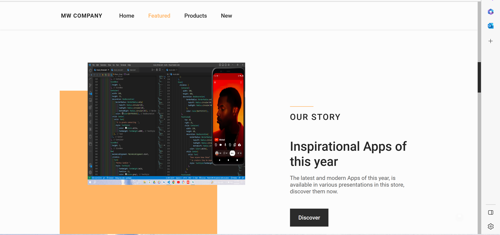
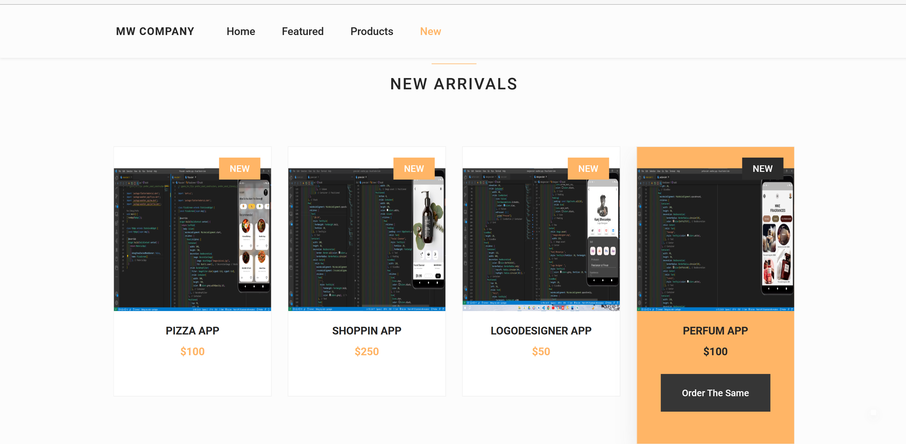

# Representive Apps website


You can see the screenshots of the application from [screenshots](#screenshots) part. 

## What does this project include?
- Home page Consist of one screen from app we made 
- features consist of apps with price and so on 


## How to run the project
1. First you need to clone the project with and go to directory
	```
	> git clone https://github.com/MWdevelopmentCompany/web
	> cd e-commerce-frontend
	```
2.  complete the steps explained in the [readme](https://github.com/MWdevelopmentCompany/web/README.md).
3. Then you need to install the dependencies with
	```
	> yarn install or npm install
	```
4. Then you need to start the server with 
	```
	> yarn start or npm start
	```

Then it will run the project at `localhost:3000` if `3000` is occupied, it will run in `localhost:3001`. If there is any errors when frontend tries to connect to backend (proxy errors), change the proxy to point to backend in `package.json`.


## Screenshots








